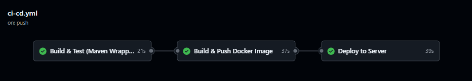
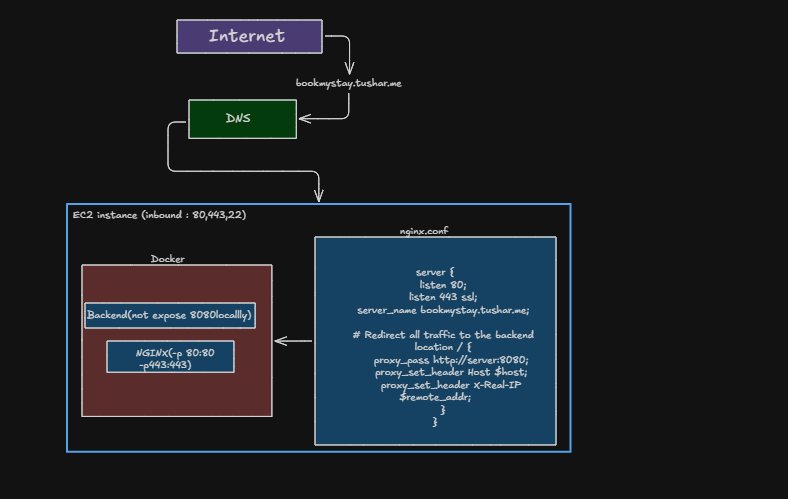
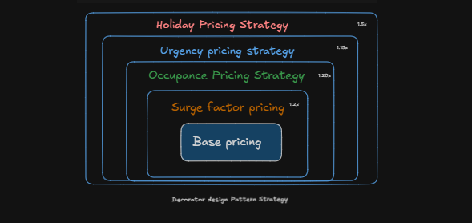

# BookMyStay

A production-ready hotel management and booking backend built with Spring Boot. Covers the full guest journey — hotel discovery, room search, booking, payment, and cancellation — with dynamic pricing, JWT auth, Stripe payments, and rate limiting.

**Live Demo:** [bookmystay.tushardev.me](http://bookmystay.tushardev.me/api/v1/swagger-ui.html)

---


## Features

- **JWT Authentication** — short-lived access tokens (10 min) + long-lived refresh tokens (6 months) in HTTP-only cookies
- **RBAC** — `GUEST` and `HOTEL_MANAGER` roles enforced via Spring Security
- **Hotel & Room Management** — full CRUD + activation for hotels and rooms
- **Inventory System** — per-room, per-day inventory auto-initialized for the next year on activation
- **Hotel Search** — by city, date range, and room count, with pagination
- **Booking Lifecycle** — `RESERVED → GUESTS_ADDED → PAYMENTS_PENDING → CONFIRMED → CANCELLED`
- **Stripe Payments** — Checkout sessions + signed webhook confirmation
- **Automatic Refunds** — triggered on cancellation of a confirmed booking
- **Dynamic Pricing** — decorator-chain strategy: surge → occupancy → urgency → holiday multipliers
- **Holiday-Aware Pricing** — Indian public holidays synced from Calendarific on startup
- **Concurrency Safety** — `@Lock(PESSIMISTIC_WRITE)` prevents double bookings
- **Login Rate Limiting** — Bucket4j, 5 requests/min per IP
- **Scheduled Price Updates** — daily cron recalculates prices and refreshes `HotelMinPrice`
- **Revenue Reporting** — confirmed bookings, total revenue, avg. revenue per booking
- **Global Response Wrapping & Exception Handling** — consistent `ApiResponse<T>` envelope and error format
- **Health Checks** — `/actuator/health`, `/actuator/info`, plus a prod-only LB probe endpoint
- **Swagger / OpenAPI** — docs at `/swagger-ui.html`
- **CI/CD Pipeline** — self-authored GitHub Actions workflow (`CI/CD - Build, Push, Deploy (bookmystay)`) that builds the jar, pushes a Docker image to Docker Hub, and deploys to the server over SSH on every push to `main`

---

## Tech Stack

| Layer | Technology |
|---|---|
| Language | Java 21 |
| Framework | Spring Boot |
| Security | Spring Security + JWT (jjwt) |
| Database (dev) | PostgreSQL (local) |
| Database (prod) | AWS RDS PostgreSQL |
| ORM | Spring Data JPA / Hibernate |
| Payments | Stripe Java SDK |
| Holiday API | Calendarific |
| Rate Limiting | Bucket4j |
| Build Tool | Maven (with Maven Wrapper) |
| API Docs | SpringDoc OpenAPI |
| Monitoring | Spring Boot Actuator |
| Containerization | Docker (`eclipse-temurin:21-jdk-alpine`) |
| CI/CD | GitHub Actions → Docker Hub → SSH deploy |
| Deployment | AWS EC2 (Docker Compose) |

---

## Running Locally

**Prerequisites:** Docker & Docker Compose, PostgreSQL running on port `5432`.

**1. Clone the repo**
```bash
git clone https://github.com/01tushar26/BookMyStay.git
cd BookMyStay
```

**2. Create the database**
```sql
CREATE DATABASE airBnb_vl;
```

**3. Create `server/dev.env`**
```env
JWT_SECRETKEY=
H_APIKEY=
S_APIKEY=
S_WEBHOOK_SK=
DB_PASS=
SPRING_PROFILES_ACTIVE=dev
```

| Variable | Description |
|---|---|
| `JWT_SECRETKEY` | Secret key for signing JWTs (min 256-bit) |
| `H_APIKEY` | Calendarific API key for holiday data |
| `S_APIKEY` | Stripe secret key |
| `S_WEBHOOK_SK` | Stripe webhook signing secret |
| `DB_PASS` | PostgreSQL password for `airBnb_vl` |
| `SPRING_PROFILES_ACTIVE` | `dev` locally, `prod` in deployment |

**4. Build the jar**
```bash
cd server
./mvnw clean package -DskipTests
```

**5. Build the Docker image**
```bash
docker build -t bookmystay:latest .
```

**6. Start with Docker Compose**
```bash
docker compose -f docker-compose.yml up 
```


---

## CI/CD

Every push to `main` that touches `server/**` & `.github/workflows/ci-cd.yml` runs `.github/workflows/ci-cd.yml`.

<p align="center">
  
</p>


---
## AWS(EC2) Architecture


<p align="center">
  
</p>


---


## Dynamic Pricing Engine

```
Base Price
  → × surgeFactor               (set by hotel manager)
  → × 1.20 if >80% booked       (occupancy)
  → × 1.15 if within 7 days     (urgency)
  → × 1.50 on holidays/weekends (holiday)
```
<p align="center">
  
</p>
The final price is stored in `Inventory` by the daily `PricingUpdateService` cron. `HotelMinPrice` stores the minimum price per hotel per day and powers search.

---


## Key Engineering Highlights

- **Dynamic Pricing (Decorator Pattern)** — composable, extensible pricing chain
- **Cron-based Aggregation** — precomputed `HotelMinPrice` avoids real-time search costs
- **Concurrency Safety** — pessimistic locking prevents double bookings
- **Secure Payments** — Stripe Checkout + verified webhooks
- **Revenue Analytics** — bookings, revenue, and averages over date ranges
- **JWT + RBAC** — strict role separation between guests and hotel managers
- **Normalized Data Model** — full JPA association mappings across the domain
- **Automated CI/CD** — build, containerize, and deploy on every push to `main`

---